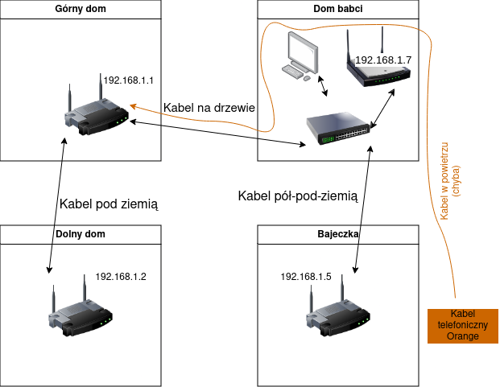

# Jak działa internet na Dwernik 6

Na gospodarstwie mamy cztery domy, i każdy z nich ma swój ruter. Ponad to, mamy kilka czujników (temperatury w Bajeczce itp), które działają po LANie - dlatego też całość jest ustawiona dość niestandardowo, co ten oto dokument opisuje :)


## 0. Nazewnictwo

Żeby była jasność który dom jest który itp - będą dalej nazywane tak i **tylko tak**.
- "Górny dom" - nasz pierwszy, duży dom przerobiony z owczarni. Dwernik 6A. Nie mylić z domem babci, który też jest na górze
- "Dom babci" - duży trójkątny brązowy dom babci na górze
- "Bajeczka" - Bajeczka :)
- "Dolny dom" - nasz nowy dom na dole

Kabelki:
- Wtyczka/kabel - męska wtyczka którą sie wpina *do* czegoś
- Port/gniazdo - damski otwór *do którego* coś sie wpina
## 1. Internet sam w sobie

Internet mamy od Orange, dostarczany po kablu telefonicznym. Jest to biały, płaski kabel który w górnym domu idzie koło dużego okna w kuchni, nad resztą okien aż do dużego pokoju gdzie trafia do głównego rutera.

W okolicach dużego okna jest jakieś białe plastikowe gówienko z telefonicznymi gniazdkami, przez które on przechodzi - ono było kiedyś do telefonu stacjonarnego, i teraz tam po prostu jest. Nie rozpinać, jak ktoś rozepnie to tak powpinać tak żeby zadziałało :)

Dalej kabel ten idzie do białego walcowego pudełeczka wiszącego na ściane domu, z którego wychodzi kabel (chyba) wiszący przez drzewo, do domu babci, bajeczki, aż do słupów telefonicznych koło bajeczki.

> Zdarzały się incydenty, że kabel wiszący do babci uszkdził wiatr/ktoś - trzeba na to zwłaszca uważać, bo przez niego i tylko niego płynie internet dalej do świata, a żeby go naprawić prawdopodobnie będzie trzeba wzywać Orendża.

To, jak orendż działa, co ustawić w ruterze itp będzie opisane dalej.

## 2. LAN, wewnętrzna sieć na gospodarstwie

Tak jak mówiłem, mamy kilka smart-czujników rozsianych po gospodarstwie, i żeby to ładnie działało to **wszystkie** rutery muszą działać w jednym wspólnym LANie

Żeby to uzyskać, wszystkie rutery poza głównym (w górnym domu) mają kable ethernet wpięte do jednego (dowolnego) z portów LAN✅ - NIE do WAN❌!! Oraz **wyłączony** serwer DHCP❌

> Dlatego też jeśli po podłączeniu do któregoś WiFi długo pisze "Uzyskiwanie adresu IP", a potem sie rozłącza, to znaczy że nie ma połączenia z głównym ruterem który by to IP rozdał

## 3. WiFi

**Wszystkie** rutery mają wifi "Dwernik6" bez hasła. Trzeba kliknąć w telefon tylko raz i ma sie zasięg na całym gospodarstwie.

## 4. Rutery - gdzie są, co robią

### 4.1 Górny dom 🏠
W górnym domu jest główny ruter, "TP-Link Archer VR400", który odbiera internet od Orange i rozdaje go wszystkim innym. Jest on bardzo ważny, bez niego nikt inny ani nie ma internetu ani LANu. Ma też dość duże obciążenie, bo musi obsłużyć dziesiątki urządzeń ze wszystkich domów, więc jeśli komuś kiedyś przyszłoby do głowy "tak po prostu" zmienić go na inny losowy ruter ze strychu to odradzam, bo jak na razie radził sobie z tym bardzo dobrze.

Do portów LAN powinny być wpięte conajmniej 2 kable:
- duży gruby czarny, który idzie do domu na dole
- drugi duży gruby czarny, który idzie do babci

Ustawienia:
- IP: 192.168.1.1
- login: `admin`
- haslo: `b$DQ2@YZs9j&ob$m4Qp@*VWU`

Archer jest **jedynym** ruterem który ma włączony serwer DHCP, wiec to on dyktuje adresy IP wszystkim. Z tego co pamiętam to ma po prostu ustawione 192.168.1.X, od 10 do 200, maska normalna 24 (255.255.255.0) (wszystko inne wszędzie ma też normalnie 24).

Internet idzie po białmym kablu, i używa protokołu PPPoA, z takimi ustaiweniami:
```
vpi - 0
vci - 35
VC/MUX
CHAP
```
Z tego co pamiętam to tyle - nie ma tam żadnych innych haseł loginów ani nic, po prostu ustawić to, wpiąć i powinien być. Znaczy, czasami nie ma, ale to już Orange :)

### 4.2 Dom babci 👵

W domu babci jest osobno:
- biały switch TP-Link który nie ma żadnej konfiguracji i przesyła wszystko jak leci
	- IP: brak
	- Wpięte 4 kabelki:
		- z internetem z górnego domu
		- do access pointa
		- idący do bajeczki
		- i do komputera dziadka
- czarny access point który nadaje wifi linksys-cośtam
	- IP: 192.168.1.7
	- login: -pusty-
	- hasło: `6whRmrQvYm2G`


### 4.3 Bajeczka 🌈

"TP-Link TL-WR740N"

Ustawienia:
- IP: 192.168.1.5
- login: `admin`
- hasło: `tjnL3dYZTyv9B7`
	- (obecnie został zresetowany, i jest `admin:admin`)

### 4.4 Dolny dom 🏡
"D-Link DWR-921 (c3)" z OpenWrt

Ustawienia:
- IP: 192.168.1.2
- login: `root`
- hasło: `LM#BP6G9K&UwjE#Ufzv$8K2^`
