You may be reading this post because of two reasons:
 - A - you're looking for resources about reducing ATTiny85 power consumption + deep sleep
 - B - you are really bored and are stalking my personal life
 - <sub><sup> C you're my english teacher</sup></sub>

With both `A` and `B` you should be satisfied - but `A` *may* leave you with unanswered questions, because I'll be talking mainly about my specific use-case (described below).

"Option-A-choosers" should also know that this isn't a typical "scroll down to copy-paste the answer". You should probably read the whole thing :wink:

## What I'll be crafting
Main idea is - a pretty, flashy heart that's ment as a gift :)

Besides being pretty and flashy, it would be awesome if it would also turn out :sparkles:useful:sparkles:

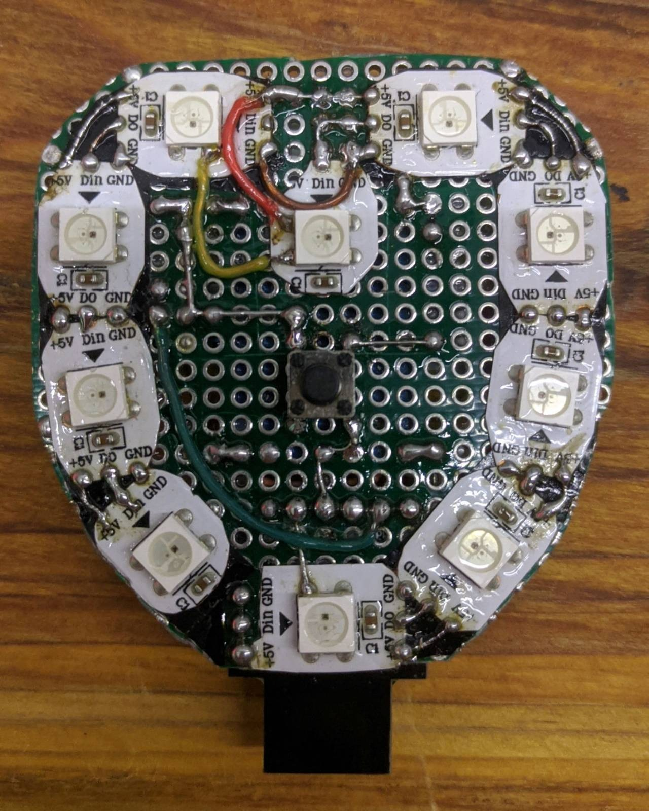 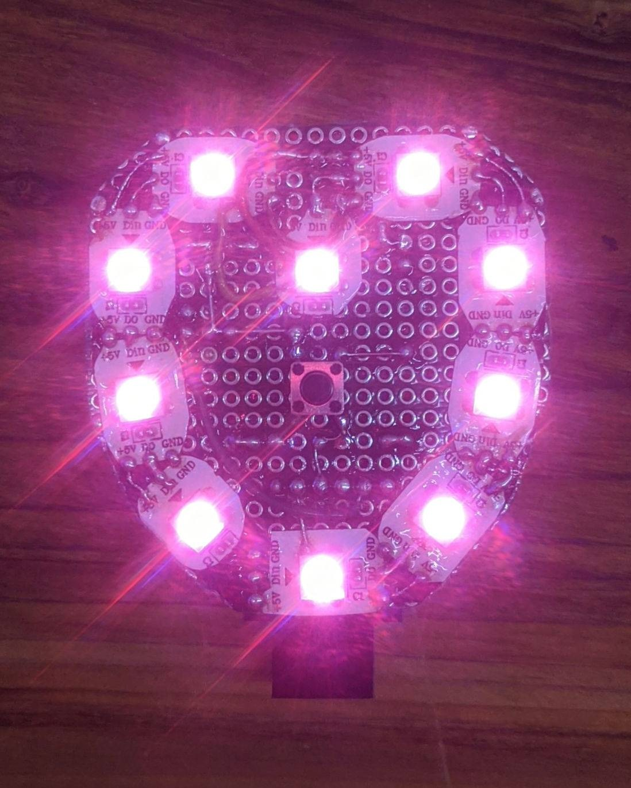

### What it will do
I want it to work like a standard light/torch - you have a single button that you click to enable it, then it changes modes, then it turns off. From user perspective, this is blatantly simple. But form electrical/programming side, it may be a challenge.

The modes/functions:
- some pretty animations like rainbow etc
- torch - 100% brightness with white color
- night light - dim and red-ish light - for walking around a house at night
- backlight - for a bike or night walk - red bright light blinking like a heartbeat
- showing battery level
- animation when charging

## Parts
 - ~~For base, I'll use this cheap, brown-ish, single-sided, 5x7cm prototype PCB~~

   Actually, the brown ones turned out to be very fragile, and copper pads de-soldered *all the time*, so I finally used the green one:

   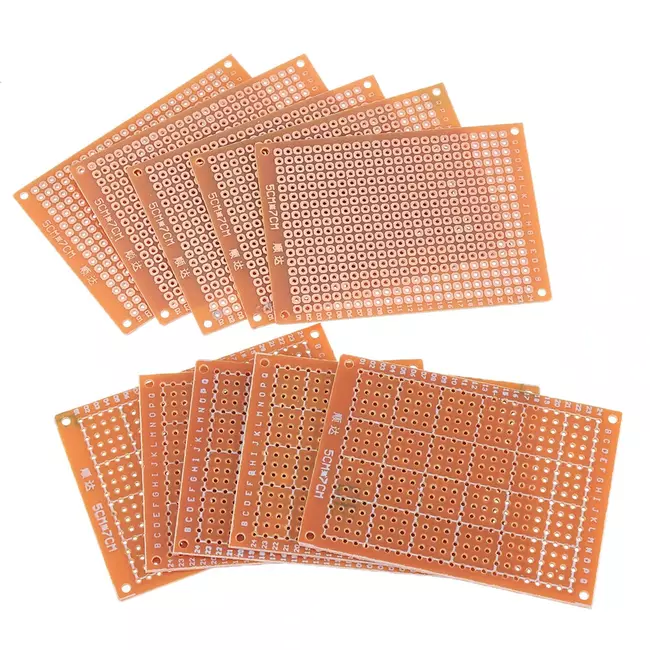 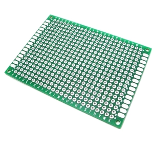

   ~~Double-sided green ones may be stronger, but would be a pain to solder since everything would touch the other side...~~ - i solved that by covering some parts with isolation tape

 - Battery will be taken care of by, beloved, TP4056 :heart:

   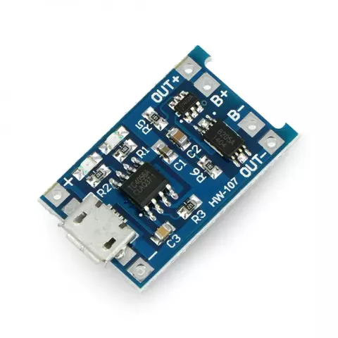

   One thing I did, is replacing it's `R3` resistor with 10kOhm - this will limit the charging current to 130mA. This will be healthier for our battery. Check out this video: https://www.youtube.com/watch?v=6asCEBm4ZAw

   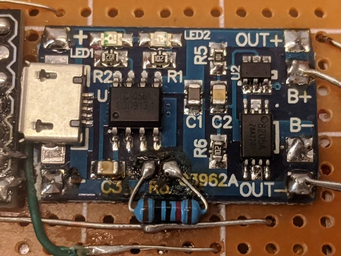
   
   Oh, and I'll also de-solder the USB port, since Digispark already has it

 - LEDs of choice are, of course, WS2812. I'll use the strip instead of bear-bones SMD's - it will save some mess with soldering
 - :drum::drum::drum: and at the heart of everything, will be _**the**_ ATTiny85 - precisely, a Digispark board:
 
   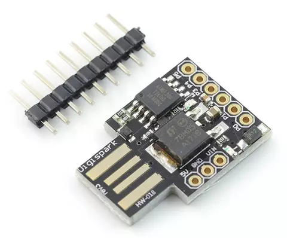

After laying everything out, this is how it initially looks:

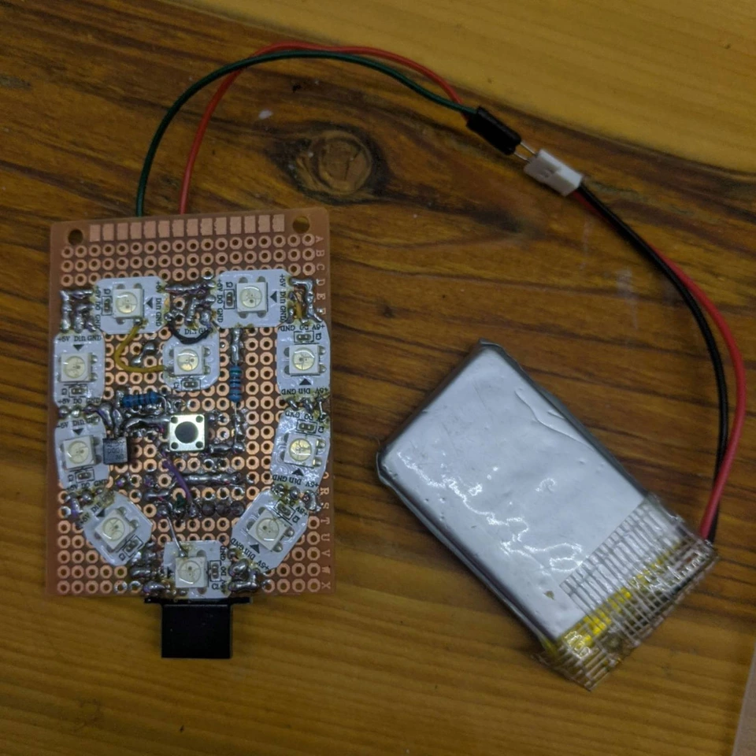
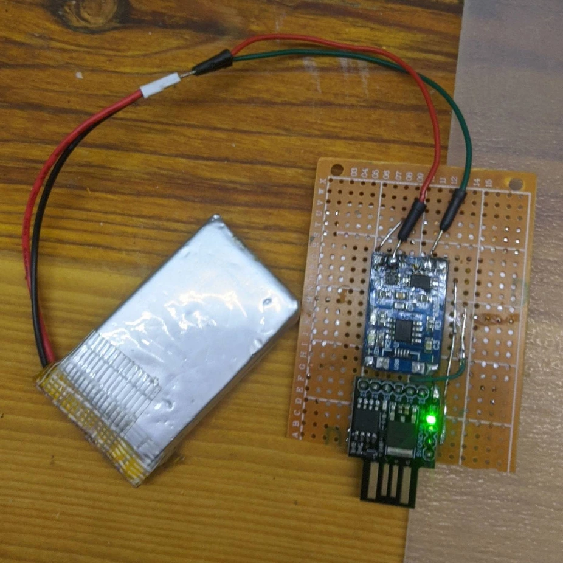

## Making it low-power
...this is the part for all "option-A-choosers"

> Preamble: I am not a professional electronics engineer, and I didn't precisely measure every single step. I messed with this for 3 full days straight, and I'm gonna just tell you what I did :relieved:

Lifecycle we want to achieve:
- *The heart* will be woken up by a button press, and will turn on the LEDs. In that mode, we don't care about the usage *that much*, but would be nice to bring it down too - that way, we could maybe have the "red backlight" mode running for long time :heart:

- ...after light is turned off, ATtiny goes to deep sleep. This is what we care about **the most**, since user could leave the heart in that state for *a while* - maybe even a year. And we don't want to waste all the power *while turned off* - do we?

### Cutting away unnecessary parts
First off - [grab yourself a digispark schematic](digispark-schematic.pdf)

Things from Digispark board that we can throw straight away - they waste power all the time:
- green power LED - this (as well as the red one) take hell lot of power - like 5mA~something => PWR on schematic
- big ass voltage regulator - I don't even know why they put it here - 99% of people will never use it - anyway, it also takes like 10~ish mA => MC78... on schematic

There also is a 1KOhm pull-up resistor (R3 on schema) that keeps wasting power... but it's kinda required for USB communication... Solution? Solder it directly to USB-5V instead of VCC - this way it will only work with USB connected. Guy in this tutorial showed it nicely: https://www.instructables.com/Reducing-Battery-Power-Consumption-for-Digispark-A/ - but he suggests messing with a knife to cut the SMD resistor off (??) - I went ahead, de-soldered it altogether and used my own big ass THT one :relieved:

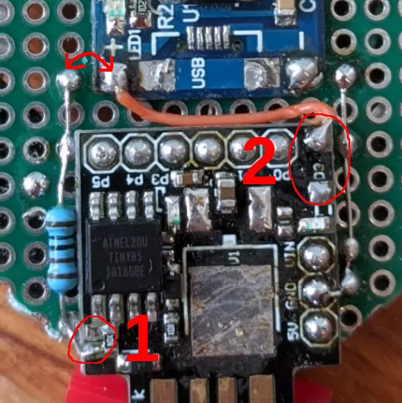

`1` was the R3 resistor. `2` was the diode that connected 5V from usb to VCC of the board. I de-soldered it too, and connected 5V to input of the charger and *my own* pull-up

Actually, there turned out to pe a very cool side effect of this - now we can easily read if board is connected to usb with a simple `digitalRead(3)` (https://github.com/TheLastGimbus/mklove/commit/bd1b86d3)

Ps. If you're evaluating if zener diodes for USB draw power or smth - don't. I tried de-soldering them, and it didn't make a µA difference :ok_hand:

#### Other hardware surprises
This may not apply to you, but it turned out that WS2812's also drain power *while off* :flushed:

Quite a lot of it, actually...

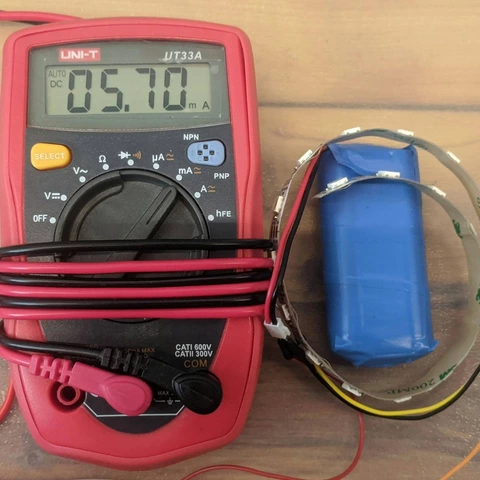

This :point_up: is 19-LEDs strip, draining 5.7mA (that's 0.3mA per LED) *while off*! My heart has 10 of those, so - consuming 0.3*10=3mA - with a 150mAh battery - it would go from 100% to 0 in 150/3/24 ~= 2 days - **while off**

That's why I had to add small mosfet transistor to cut the power from LEDs:

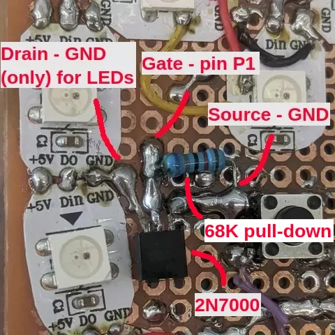

### Playing with bootloader
While playing with deep sleep (more on that later), I discovered that ~50% wakes from it end up with reboot rather than back to my code - meaning, ATtiny does it's "6-second initial delay" thing

We do not want that - we want user to press the button and have the light instantly - besides, it wastes power too :roll_eyes:

So - turns out that Digisparks are running this neat thing called [micronucleus](https://github.com/micronucleus/micronucleus) - it's a bootloader with soft-USB out-of-the-box! [Digistump Wiki](http://digistump.com/wiki/digispark/tricks) says that if you want to remove "the 6-second delay", you should install alternative flavor of that bootloader, where it waits only if P0 is pulled down on boot.

Sounds great! Thing is, the links are old, and nowadays-version of micronucleus does not include that flavor compiled in "releases" folder. Luckily, I've successfully managed to compile it myself!

Here is my fork: https://github.com/TheLastGimbus/micronucleus/tree/87346a2d/firmware/upgrades - I added "`
upgrade-t85_jumper.hex`" and "`upgrade-t85_jumper_bod_disabled.hex`" versions - `bod_disabled` version should use even less power :)

> Note: If you're curious, BOD is some 'thing' that watches for voltage drops - you probably don't need this

Once you download `.hex` file of your choice, download the `micronucleus-cli` tool itself from their releases: https://github.com/micronucleus/micronucleus/releases

Then, open the terminal, and just run it: `./micronucleus upgrade-t85_jumper_bod_disabled.hex` - similarly to uploading your Arduino code, you first run it, and then plug the USB in :eyes:

...in my case, it didn't really work at first try :face_with_monocle: - try a mix of uploading bootloader, then the code, then bootloader again until it works :heart:

> Note: this seems scary, and sounds like something you could brick your device with! Well... probably yes, but I've done it few times with few boards, and didn't brick anything <sup>yet</sup>!!
> 
> > But, as a precaution, you probably should try with some backup board first :wink:


Tada :tada: boots _**instantly :100:**_

### Saving power with code

#### Disabling ADC
ADC draws quite a lot of power (few mA's) just by sitting there - you will find quite a few different ways to disable it 0_o - many of them didn't work for me - in particular, the nice one `disable_adc()` from `#include <avr/power.h>` didn't :(

Here are ones I made:
```cpp
void disableAdc() { ADCSRA &= ~_BV(ADEN); }

void enableAdc() { ADCSRA |= _BV(ADEN); }
```

With these, you can just disable ADC at startup, and dynamically enable it for few ms when using it :+1: - make sure to disable before for deep sleep tho!

#### Going deep sleep
Here are my sleep functions:
```cpp
// Will be called when button pressed
void wake() {
    detachInterrupt(0);  // Disable the interrupt - will not be called anymore
    sleep_disable();  // Precaution
}

// Some additional setup *before* sleep itself
void _preSleep() {
    disableAdc();
    digitalWrite(LED_BUILTIN, LOW);
    pinMode(PIN_LEDS, INPUT_PULLUP);
    digitalWrite(PIN_MOSFET, LOW);
}

/// Go to deep sleep with interrupt wakeup
void sleepNow() {
    _preSleep();

    attachInterrupt(0, wake, LOW);
    noInterrupts();  // This should (?) make it more reliable ??
    set_sleep_mode(SLEEP_MODE_PWR_DOWN);
    sleep_enable();
    interrupts();
    sleep_cpu();  // This is *the* moment where it sleeps
    sleep_disable();  // ...and this is when it wakes up
    detachInterrupt(0);
}
```

### Results :tada:

After all of those modifications, my Digispark board uses `3.5uA` of current *while in deep sleep*, and about `13mA` *when on* (with LEDs disabled of course) :ice: :sunglasses:

With a `400mAh` battery that I use, it will last:
- `400mAh/0.0035mA/24hours/365days = ~13 years` !!
- `400mAh/13mA/24hours = ~1.25 days` when running (with LEDs off)

This is nice!

## Coding it!

After all of this mess, actual programming was pretty straightforward... well, except...

### Flash size issues
Turns out ATTiny85 is... well... tiny. While I was casually adding library for the LEDs, for buttons, and started implementing some crazy animations, I was surprised with PlatformIO telling me I don't have any space left!!

After some optimizations and trade-offs, I realized I have a new bootloader. Which, conveniently, takes less space. So, now, I can *tell* PlatformIO that, "hey, I DO have space!":

```ini
; PlatformIO Project Configuration File

[env:digispark-tiny]
platform = atmelavr
board = digispark-tiny
framework = arduino
; ### HERE IS THE THING ###
; I don't want to get you into a hell of calculating this magic value. Here is micronucleus' "guide" if you really need it: https://github.com/micronucleus/micronucleus/blob/c2c7fa096de55303f324ec7d650d71d10cc29d1a/firmware/configuration/t85_default/Makefile.inc#L20
; But - if you just uploaded *my* bootloader just as I did above, you can freely pase this:
board_upload.maximum_size = 6586  
lib_deps =
    fastled/FastLED@^3.5.0
    git+git://github.com/TheLastGimbus/EasyButton#attiny85-hack
```


### Code itself
Whole code is available on my GitHub: https://github.com/TheLastGimbus/mklove/

## Conclusions

- Coding in C++ *actually* can be fun, and feel cool - unless you're not doing anything advanced
- ATTiny85 itself is pretty problematic 
  - throughout the whole journey, 3 of them just bricked, for no good reason :shrug:
  - deep sleep sometimes breaks, and only solution is a reboot :confounded:
  - very small flash size - while it can be *fun* in a way, you can't do a lot of magic in there :(
- after a lot of mess and de-soldering - you can actually get a nice deep sleep - so that you can leave the device on a small battery for good couple of months :)

- _**giving your crush a battery-powered-led-heart is, actually, a good way to start a relationship :sparkling_heart:**_