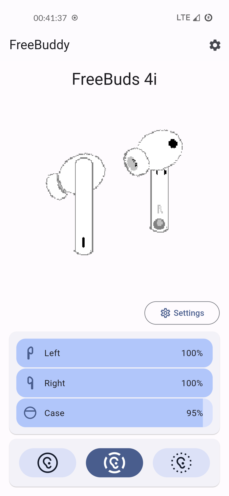
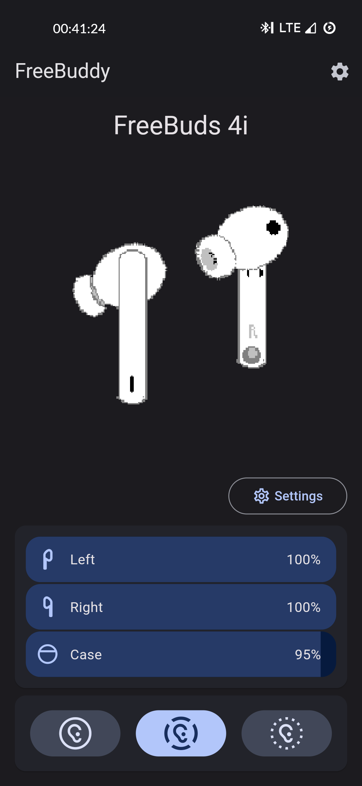
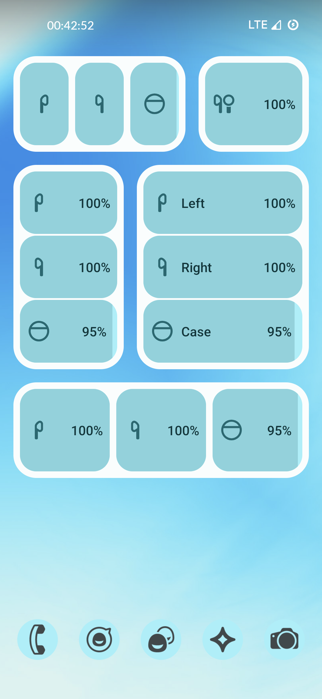
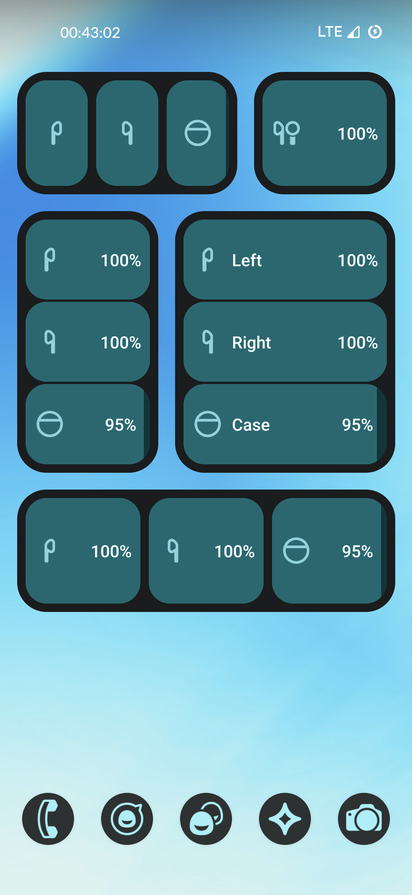

# FreeBuddy 🎧

A FOSS companion app for your headphones!





## The story 🛣️
I wanted to quickly switch ANC modes on my headphones. So, I downloaded an official companion app from the vendor - it weights 300mb, takes up to **10 seconds** to launch, then takes it's own internal updates to run, and then, it kindly, allows me to do it

Also, it turned out that "find lost bud by last-seen GPS position" feature was only available to pro model - even tho mine could do this as well, but they just decided to disable this for cheaper ones

"This is bullshit", I thought. So I pulled out Wireshark🦈, figured out what commands are sent for different ANC modes, and made my own app. And here we are 🎉🎉🎉

## FreeBuddy is freedom from bullshit 🚫💩

FreeBuddy aims to be a community-built app for *all* headphones out there, supporting all of their features, and adding extra ones with ✨magic of code✨

## Currently supported models 🎧

**Right now**, freebuddy supports these headphones, with **all** of their stock-app features:
- Huawei Freebuds 4i

 

## Custom cool features 🛠️💅

Also, freebuddy is already one step ahead of capitalism - it has a nice home widget with battery levels :>

  

## Download 📦

| Platform   | Installation        |
|------------|---------------------|
| _Any ⭐_   | [Github Releases](https://github.com/TheLastGimbus/FreeBuddy/releases) (Note: signed with debug keys) |
| Android 🤖  | [Google Play](https://play.google.com/store/apps/details?id=com.lastgimbus.the.freebuddy) |
| Windoza 💩  | TODO: Windoza build |
| Linux 🐧   | TODO: L00nix build  |

## Community and [development](dev) 👨‍💻👩‍💻

All notes on inner workings, reverse-engineering guides live in [dev](dev)

If you're interested in supporting more headphones, want to help, or just chat, feel invited to hop on Discord channel to:

