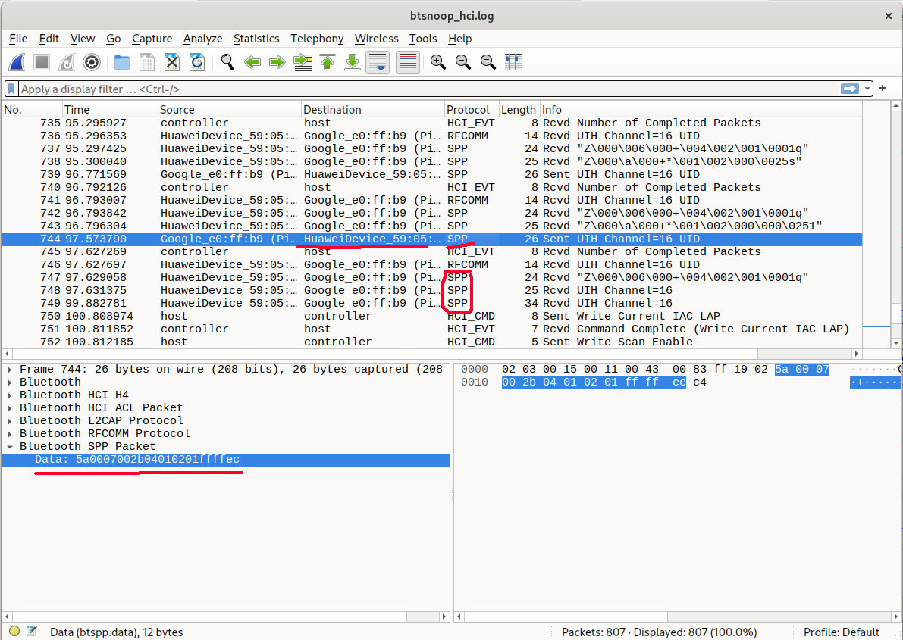
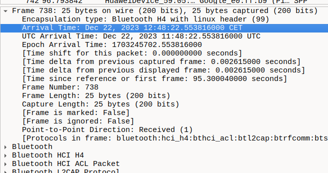

Freebuddy aims to be community-built:
1. because it's wholesome
2. because I can't physically buy, use, and support 95267 different headphones

So, if you're even remotely interested in helping - either by coding support for your model, or even just testing if it works, reporting what features vendor provides, etc - you're a first-class citizen here ❤️

---

Below are some guides for people like you - but note that technical guides assume that you
- know some computer science basics - what are bytes, hex numbers, buffers, etc
- are running Linux - for windoza, you'll need to reaserch how to do stuff there
- will google stuff if I don't describe it
- know how to connect your phone with `adb`
- know *some* programming
	- know Dart/Flutter, preferrably

## Reverse engineering new headphones 🥼

We want to figure out how stock app communicates with our buds - how it sends commands, reads their batteries etc

Any custom functionality like that could be done either by Bluetooth Low Energy (for example, AirPods use it), or Bluetooth Classic (FreeBuds use it). Both can be chaotic and crazy complicated, but we can do this 💪

For now, all freebuddy models use bt classic - but there is plantey more resources online for BLE, so newcomers shouldn't have that much struggle

**Anyway**: what we gonna do is:
1. Get some way to snoop into what magic-binary-commands are send
2. Use all different features, buttons etc in the official app
3. Try to link these two - "what gets sent when i press X"
4. For received stuff - like battery levels - we'll have to look for what we know - if you know that battery levels are L85%, R60%, C20%, try to find if any received command has those values somewhere

You may find yourself asking "okay, I have found *some* `5a0006002b040201003171` - what the hell does it mean??". Well, that's the "computer science basics" that I've wrtitten above. These guides will help on specific quircks of freebuddy, but general stuff like how to read hex data, I encourage you to go online because there's infinite amount of awesome blogs, tools, and conference talks about it 💝

### ...okay fineee, I will tell you 🙄
`5a000600...` is some number in [https://simple.wikipedia.org/wiki/Hexadecimal](hexadecimal). How we know this? It has some numbers and letters, but letters are only from A to F, so it's pretty obvious 👀

Then, we can try to boil it down by assuming that it is a series of bytes - that is, `5a0006` means `[90, 0, 6]` and not `5a00 => 368646`. Why? Because we're using a computer. Computers talk in bytes. And programmers do too.

Then, we try to spot what those numbers mean. They can be numerical values, like headphone charges, or text - try using some tool like https://cryptii.com/pipes/hex-decoder - for further inspiration, read along

### Possible capture approaches 🎣

#### Official app logs 📜

If we are lucky, the official app of you headphones logs all bluetooth commands, and maybe even describes what they do - that's the case for Huawei

In that case, all you need is Android phone with debugging enabled, and some logcat reader - either full blown Android Studio, pure `adb logcat`, or one of these android apps. I recommend Android Studio as it has nice filtering and colors

#### Looking through .apk 📂

You can also try to reverse engineer the apk itself - you may be lucky and find some names, values etc right there 👀 - note that this may be hard, and may not bring you anything useful 🤷 - but worth trying!

#### Sniffing with Wireshark 🦈

> Based mostly on awesome: https://blog.davidv.dev/reverse-engineering-the-bose-qc35-bluetooth-protocol.html
> 
> Also look at: https://reverse-engineering-ble-devices.readthedocs.io/en/latest/protocol_reveng/00_protocol_reveng.html#logging-via-android

Wireshark is all-in-one tool for capturing network stuff, and can also handle bluetooth 💙. It may seem overwhelming at first, but just keep breathing and it will all make sense in a moment

Go into android developer options, and enable "Bluetooth HCI Snoop Log"

> Now, I would highly recommend live-capture using `extcap-interface=android-bluetooth-btsnoop-net-`... but it seems like that doesn't work anymore :( https://gitlab.com/wireshark/wireshark/-/issues/17309

So, what you have to do instead: use different features in the official app and *carefully* remember hour-minute-second when you did what. Next:

```bash
# pull logs from your phone
# *some* phones lock that out for normal users :( 
# - you will have to go root in that case
adb pull /data/misc/bluetooth/logs/btsnoop_hci.log output-folder/
```

Next, just `File > Open` this `.log` file in Wireshark 🎉



Wireshark shows you *everything* - every little bit and byte that was sent - stuff that interests **us** (at least in Bluetooth Classic case) are SPP commands

You can filter for them by typing `_ws.col.protocol == "SPP"` in the filter field at the top

Of couse, we also only look for our headphones - you can filter for them too with `bluetooth.src == mac:of:your:headphones || bluetooth.dst == mac:of:your:headphones` (as you see, `and` and `or`s work just like in programming 😁). You can also do that by right-clicking on anything and "Apply as filter"

Last thing you need is the precise time of commands - you can find them in `Frame` details:



That's everything! Now figure those commands out 🧠🧠🧠

### Figuring out the commands 1️⃣0️⃣1️⃣0️⃣

This is the most demanding part, but reading already-known stuff will help you by a ton, because most vendors probably don't re-invent the wheel. Especially useful stuff:
- [freebuddy's wiki on MBB protocol used by huawei](https://github.com/TheLastGimbus/FreeBuddy/blob/master/notes/mbb-protocol-wiki.md)
- [@melianmiko's awesome breakdown of the same thing](https://mmk.pw/en/posts/freebuds-4i-proto/)
- [previously mentioned davidv.dev blog](https://blog.davidv.dev/reverse-engineering-the-bose-qc35-bluetooth-protocol.html)

## Actually implementing in the app 📱
**In construction 🏗️👨‍🏭**

Right now, freebuddy is going thorugh a **big** refactor that will make this very simple, if you only know Dart. Once that done, i will write about it 😁