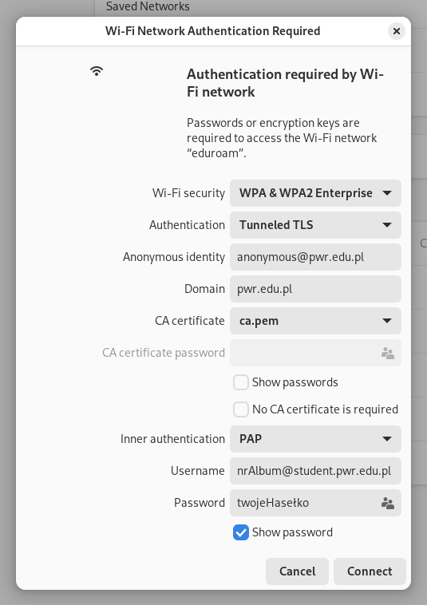

# ✨Jak sie podłączyć do Eduroam'a na PWr *na Linuxie 🐧*

> Mój setup to Arch + Gnome + NetworkManager, ale generalnie powinno działać u każdego z NetworkManagerem (czyli, w zasadzie u każdego w dzisiejszych czasach)
> 
> (Tak, jak masz Ubuntu/Minta/PopOSa to też) 👍

Eduroam korzysta z jakiegoś fiku miku enterprise systemu, gdzie potrzeba mieć fikuśny certyfikat. [Kliknij sobie tu żeby go pobrać ⭐](ca.pem). W dodatku (przynajmniej ten na PWr'ze) korzysta ze 🎉starego🎉 TLS, który jest już wyłączony domyślnie w Linuxach - włączymy go spowrotem 👍

1. Spróbuj sie połączyć do Eduroama normalnie, jak na codzień sie łączysz do rzeczy (w Gnomie czy tam KDE) (oczywiście nie zadziała) - pozaznaczaj te opcje (że Tunneled TLS i PAP) i login hasło jak do ePortalu:
	

2. Odpal to w terminalu żeby włączyć starego TLSa:
	```bash
	nmcli connection modify "eduroam" 802-1x.phase1-auth-flags 32
	sudo systemctl restart NetworkManager
	```
3. Wyklikaj żeby sie normalnie połączyć *jeszcze raz*, takie same opcje jak wcześniej
4. Powinno działać 🥳
