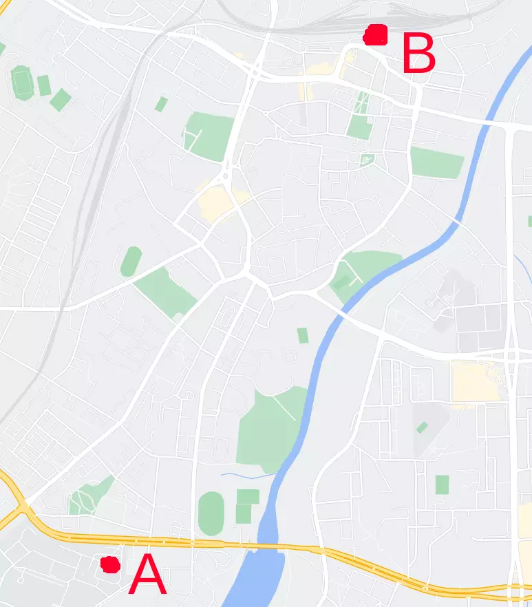
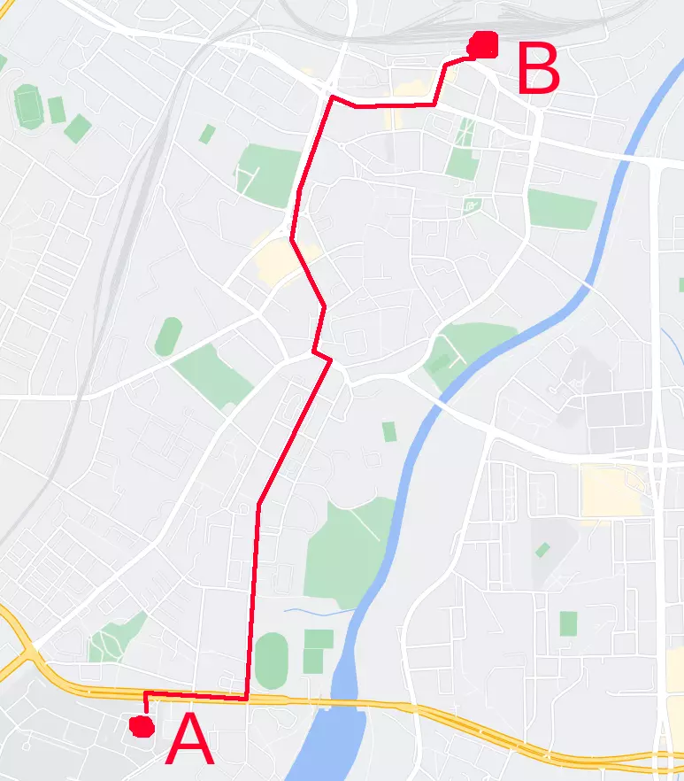
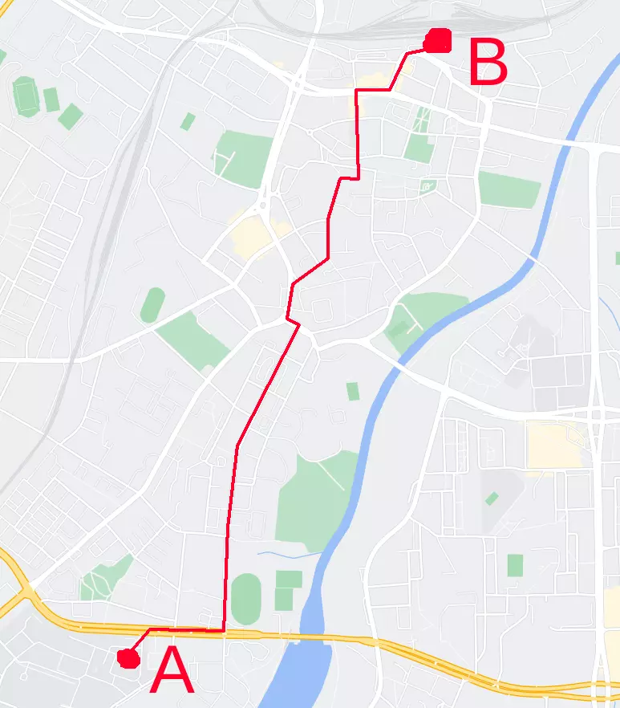
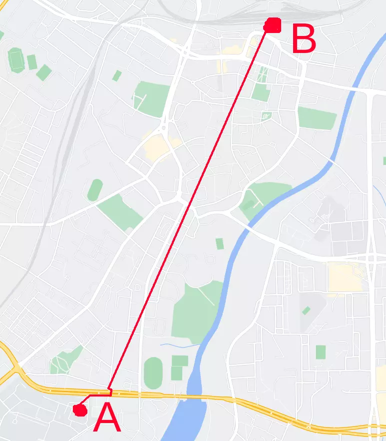

I walk. I walk a lot. More precisely, I walk from points A to B in a middle-sized city ([Rzeszów, Poland](https://goo.gl/maps/jyxNVVKLXvPdhRN16)) to get with my everyday life and tasks.

Because of that, I've given a lot of though to finding tiny ways to optimize my walking path to absurd. 

That's what Hyper-pathing is about. Taking every shortcut there is ; cutting every cut-able corner ; timing every streetlight ; jumping though every jump-able fence - whatever it takes to get **the shortest path** with **best time** while not getting too sweaty.

## Why?
Most cities - even in Europe - make no fucking sense. Get this - you have some large region, where there are offices, homes, restaurants, etc - theme park for humans. And 80% of this land is spent on fucking roads - so you can drive between your job and your home. You could probably walk there, if there weren't so many fucking roads.

Because of this, I think you should get rid of any remorse for: walking through grass (instead of cobblestone path), jaywalking, and doing generally weird stuff. Your city it (probably) broken - and you have the right to *try* to make it suit you.

## The basics
> At any point of your journey - look where you want to go, look at the straight line to there, and just go

Because of unavoidable stuff like bridges, mountains, etc, you may need to divde this straight line into several - but after that, keep close to them. If more obstacles occur, make a new straight line and go

Look at this path:

A 🤮car🤮 would go like this (3.7km):

Google *walking* navigation (that I will later reffer to as *normie human*), would go like this (3.6km):

Wait... 3.6KM? 100m less THAN A CAR??? We can do better 🙄

> With Hyperpathing, you don't use Google Maps navigation. You use compass

**The straight line** on this path (after crossing this big ass yellow street) looks like this, and takes 3.0km:

"That's not realistic - you can't just go straight like this!" - you may say. To check this, I recorded my attempt, to see how much I can skip and how long will it take. Here are the results:

// TODO: The results

### The "hyper" in hyperpathing
You see, hyperpathing is not just about roads and paths visible on Google Maps - it's about taking it to the extreme. You look where do you want to go, and you go there - on macro and mini scale. You don't care if it's grass, parking, or you need to jump over some small fence - as long as it will summarily save *any* time - don't hesitate :)

// TODO: Photos of paths
