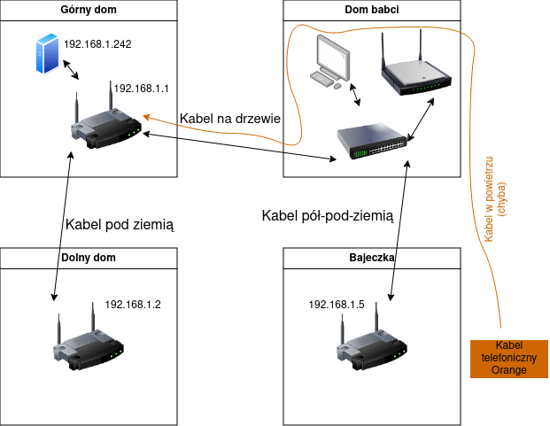

# Jak działa internet na Dwernik 6

Na gospodarstwie mamy cztery domy, i każdy z nich ma swój ruter. Ponad to, mamy kilka czujników (temperatury w Bajeczce itp), które działają po LANie - dlatego też całość jest ustawiona dość niestandardowo, co ten oto dokument opisuje :)


## 0. Nazewnictwo

Żeby była jasność który dom jest który itp - będą dalej nazywane tak i **tylko tak**.
- "Górny dom" - nasz pierwszy, duży dom przerobiony z owczarni. Dwernik 6A. Nie mylić z domem babci, który też jest na górze
- "Dom babci" - duży trójkątny brązowy dom babci na górze
- "Bajeczka" - Bajeczka :)
- "Dolny dom" - nasz nowy dom na dole

Kabelki:
- Wtyczka/kabel - męska wtyczka którą sie wpina *do* czegoś
- Port/gniazdo - damski otwór *do którego* coś sie wpina
## 1. Internet sam w sobie

Internet mamy od Orange, dostarczany po kablu telefonicznym. Jest to biały, płaski kabel który w górnym domu idzie koło dużego okna w kuchni, nad resztą okien aż do dużego pokoju gdzie trafia do głównego rutera.

W okolicach dużego okna jest jakieś białe plastikowe gówienko z telefonicznymi gniazdkami, przez które on przechodzi - ono było kiedyś do telefonu stacjonarnego, i teraz tam po prostu jest. Nie rozpinać, jak ktoś rozepnie to tak powpinać tak żeby zadziałało :)

Dalej kabel ten idzie do białego walcowego pudełeczka wiszącego na ściane domu, z którego wychodzi kabel (chyba) wiszący przez drzewo, do domu babci, bajeczki, aż do słupów telefonicznych koło bajeczki.

> Zdarzały się incydenty, że kabel wiszący do babci uszkdził wiatr/ktoś - trzeba na to zwłaszca uważać, bo przez niego i tylko niego płynie internet dalej do świata, a żeby go naprawić prawdopodobnie będzie trzeba wzywać Orendża.

To, jak on działa, co ustawić w ruterze itp będzie opisane dalej.

## 2. LAN, wewnętrzna sieć na gospodarstwie

Tak jak mówiłem, mamy kilka smart-czujników rozsianych po gospodarstwie, i żeby to ładnie działało to **wszystkie** rutery muszą działać w jednym wspólnym LANie

Żeby to uzyskać, wszystkie rutery poza głównym (w górnym domu) mają kable ethernet wpięte do jednego (dowolnego) z portów LAN - NIE do WAN!! Oraz wyłączony serwer DHCP.

> Dlatego też jeśli po podłączeniu do któregoś WiFi długo pisze "Uzyskiwanie adresu IP", a potem sie rozłącza, to znaczy że nie ma połączenia z głównym ruterem który by to IP rozdał
## 3. Rutery - gdzie są, co robią

### 3.1 Górny dom
W górnym domu jest główny ruter, "TP-Link Archer VR400", który odbiera internet od Orange i rozdaje go wszystkim innym. Jest on bardzo ważny, bez niego nikt inny ani nie ma internetu ani LANu. Ma też dość duże obciążenie, bo musi obsłużyć dziesiątki urządzeń ze wszystkich domów, więc jeśli komuś kiedyś przyszłoby do głowy "tak po prostu" zmienić go na inny losowy ruter ze strychu to odradzam, bo jak na razie radził sobie z tym bardzo dobrze.

#### Kabelki

Do portów LAN powinny być wpięte 3 kable:
- krótki szarawy idący do niebiesko-pomarańczowego urządzenia na parapecie
- duży gruby czarny, który idzie do domu na dole
- drugi duży gruby czarny, który idzie do babci
#### Konfiguracja
IP: 192.168.1.1
#####  Internet
Internet idzie po białmym kablu, i używa protokołu PPPoA, z takimi ustaiweniami:
```
vpi - 0
vci - 35
VC/MUX
CHAP
```
Z tego co pamiętam to tyle - nie ma tam żadnych innych haseł loginów ani nic, po prostu ustawić to, wpiąć i powinien być. Znaczy, czasami nie ma, ale to już Orange :)
##### LAN
Archer jest **jedynym** ruterem który ma włączony serwer DHCP, wiec to on dyktuje adresy IP wszystkim. Z tego co pamiętam to ma po prostu ustawione 192.168.1.X, od 10 do 200, maska normalna 24 (255.255.255.0) (wszystko inne wszędzie ma też normalnie 24).

##### WiFi
Nazwa: MASZ_5G
Hasło: agnieszkatumieszka


Ma jeszcze dodatkowe otwarte WiFi dla gości, "Pokoje u Agnieszki", które jest odizolowane od reszty LANu. Była taka łatwa opcja w ustawieniach to kliknąłem, ale to nie jest jakieś bardzo istotne.
##### DMZ
Dodatkowo żeby otworzyć dostęp do niebiesko-pomarańczowego urządzonka które jest serwerem, jest na jego porcie ustawione DMZ które przekierowuje wszystkie zapytania z internetu właśnie do niego. To jest dość ważne. IP tego serwera to 192.168.1.242

### 3.2 Dom babci

W domu babci jest osobno:
- biały switch TP-Link który nie ma żadnej konfiguracji i przesyła wszystko jak leci
- czarny access point który nadaje wifi linksys-cośtam.

Do białego switcha powinny być wpięte 4 kable: jeden z internetem z górnego domu, jeden do access pointa, jeden idący do bajeczki i jeden do komputera dziadka

#### Konfiguracja
IP: Brak
##### WiFi
Nazwa: linksys-cośtam
Hasło: Krysienka9

### 3.3 Bajeczka

W Bajeczce jest ruter "TP-Link jakiśtam", który nadaje WiFi i ma być wpięty do LANu

#### Konfiguracja
IP: 192.168.1.5

DHCP wyłączone ❌

##### WiFi
Nazwa: Bajeczka
Hasło: Bajeczka6


### 3.4 Dolny dom
W dolnym domu jest ruter "D-Link DWR-921 (c3)", który też nadaje WiFi i jest wpięty do LANu

Jest na nim zainstalowane OpenWrt

#### Konfiguracja
IP: 192.168.1.2

DHCP wyłączone ❌

##### WiFi
Nazwa: MASZT_6G
Hasło: agnieszkatumieszka


## 4. Inne ważniejsze urządzonka
- Niebiesko-pomarańczowy serwer w górnym domu - 192.168.1.242
- Miernik prądu - 192.168.1.171
- Czujnik wody w studni - 192.168.1.168