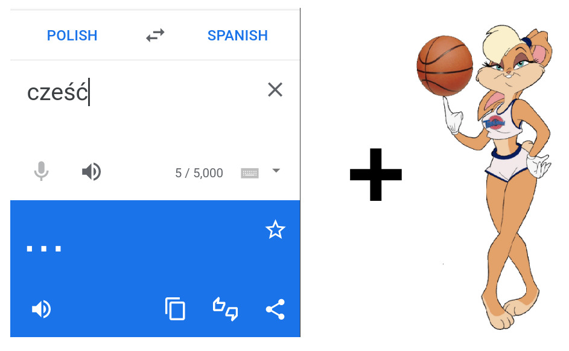
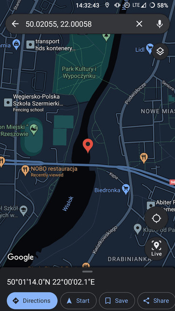

# Sharcaching Guide

Oto kompaktowy podręcznik do całej twojej wyprawy w jednym miejscu 💾

W razie gdyby któraś z poszlak była niejasna, możesz otworzyć tą stronke i dostać szczegóły

> Super, to moge od razu zobaczyć ostatnią 😇

Nie ma tak łatwo! Przy każdym etapie dostaniesz klucz 🔐 - żeby zobaczyć szczegóły każdego etapu, musisz go tu wpisać

## Opis wyprawy

<details>
    <summary>Kliknij żeby rozwinąć</summary>
    <br>

Dzisiaj zabieramy Cię na wyjątkową wyprawę! Będziesz musiało wysilić pełen 
potencjał swojej czachy 🧠, przebyć niezliczone kilometry🚶, i wykazać się niezłomnością 💪, aby dotrzeć do starożytnego artefaktu 🧐

...a bardziej konkretnie - będziesz dostawać różne instrukcje, poszlaki, i zadania, które będą ci krok po kroku wytyczać trasę do kolejnych. Wszystkie etapy (kartki, artefakty itp) możesz (a nawet powinnoś!) zabierać ze sobą, spisywać przydatne notatki i dokumentować fotografią 📷 - może Ci sie potem przydać!

Nie musisz martwić się jednak o warunki misji - trasa została dostosowana do twoich możliwości (tych ekstremalnych rzecz jasna 😏), a po drodze otrzymasz wsparcie!

Psst - Wwwwww raazie *ekstremalnych* trudności i niebezpieczeństw, możesz skorzystać z telefonu do partnera wyprawy!

</details>

## Etap 1 (kartka przy szkole)


Udaj się do:



Po prawej od okien jest rynna z różnymi naklejkami - znajdź tam kartkę z dalszą instrukcją.



## Etap 2 (kartka przy rynnie)



### Brawo 🎉🎉🎉

Udało Ci się i dotarłoś do drugiej poszlaki! Twoja kolejna misja - udaj sie do miejsca, które łączy Cie z domem, wakacjami, i resztą świata. Podpowiedź - jest tam dużo czegoś, czego aseksualnym ludziom brakuje 😉😉😉

Znajdź tam automat z kawą. Ale drogo! Nie kupuj niczego 😒 znajdź tylko cene czekolady (w złotówkach). Potem popatrz do góry - ile jest pojedynczych świecących niebieskich ekranów z rozkładem?

Zanotuj te cyferki i wprowadź je do tego wzoru żeby dostać koordynaty następnego miejsca! Tam, dostaniesz prowiant, oraz dalsze instrukcje od naszego wspólnika 😎 - powinien Cie rozpoznać, ale nie wahaj się zapytać wprost 🗣

#### Wzór:

`50.0 <cena czekolady> 055, 22.00 <ilość rozkładów - 2> 58`

#### Przykład:

Gdyby cena knopersa = 1zł, a wyświetlaczy było 2, to byłoby:

```text
50.0<1 + 1>055, 22.00<2 - 2>58 =>
50.0<2>055, 22.00<0>58 =>
50.02055, 22.00058
```

> "Pomocy, co z tymi cyferkami zrobić DD: ??"

Po prostu wklej je do Google Maps:






## Etap 3 (informacje od wspólnika)



Informacja powinna być taka, że masz znaleźć ziemie z Rzeszowskiego układu słonecznego, i poszukać koło niej qr koda 👍



## Etap 4 (QR kod)



Link do stronki: https://the.lastgimbus.com/shar-zagadka/



## Etap 5 (informacje z zagadki programistycznej)



Brawo 🎉 wrócmy do świata rzeczywistego - idź do pomnika chłopca, który bardzo nie lubi latarni - w ławce koło niego będzie schowana kolejna kartka 📜. Jedziesz 💪



## Etap 6 (informacje z kartki pod ławką)



Co jest 1440 razy w dniu, 10080 w tygodniu, ale ani razu w momencie?


Odpowiedź podaj do: [+48 533 900 794](tel:+48533900794)

(lub awaryjnie [+48 572 601 192](tel:+48572601192))



## Etap 7 (informacje z telefonu)



Idź do fontann multimedialnych. Popatrz na te wielo-poziomowe ławki. Na maksa po prawej, jest koło nich skrzynka elektryczna - szukaj koło niej w krzakach jakichś dalszych przedmiotów 👀



## Etap 8 (informacje z przedmiotów przy f...nnie)



TODO: Informacje w fontannie



## Etap 8 (informacje z labiryntu)



Brawo 🎉🎉🎉

Teraz, udaj sie do pierścienia, gdzie zazwyczaj jest fontanna, ale czasami przyjeżdża cyrk 🤡🤡🤡


